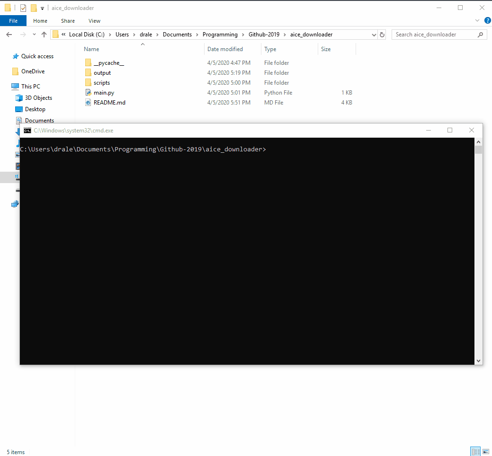

------------------------------------------------------------------------


------------------------------------------------------------------------


## Introduction

This tool was created to download Past Papers and all the associated resources in bulk. Use the command line and the `main.py` file to download the exam.s

------------------------------------------------------------------------

## Installation requirements

```diff
+ python3
+ Access to a terminal/shell/cmd
```

#### Operating Systems it works on:
- Windows Operating Systems
- MacOSX
- Linux

------------------------------------------------------------------------

## How to Install

#### 1. Install directly from the github page
#### *OR*
#### 2. Type in your terminal or cmd-line:
```
git clone https://github.com/saleguas/desktoporganizer deskorg
```

------------------------------------------------------------------------

## How to Use It

If you want the help output, then here you go:
```bash
usage: main.py [-h] [-A AICE] [-O ORDINARY] [-I IGCSE] [-LA] [-LO] [-LI]

Download Up-To-date Past Papers.

optional arguments:
  -h, --help            show this help message and exit
  -A AICE, --AICE AICE  Downloads the AICE As and A level exam with the
                        syllabus code provided. Type ALL to download all
                        exams(may take a while!).
  -O ORDINARY, --ORDINARY ORDINARY
                        Downloads the O-level exam with the syllabus code
                        provided. Type ALL to download all exams(may take a
                        while!).
  -I IGCSE, --IGCSE IGCSE
                        Downloads the IGCSE exam with the syllabus code
                        provided. Type ALL to download all exams(may take a
                        while!).
  -LA, --LISTAICE       Lists all the As and A level AICE classes with the
                        syllabus numbers.
  -LO, --LISTORDINARY   Lists all the O level classes with the syllabus
                        numbers.
  -LI, --LISTIGCSE      Lists all the IGCSE classes with the syllabus numbers.

```
If that's not enough:
1. Simply open up a terminal in the same location as the main.py file
2. Type `python main.py [COMMANDS]` and that's all!



------------------------------------------------------------------------
